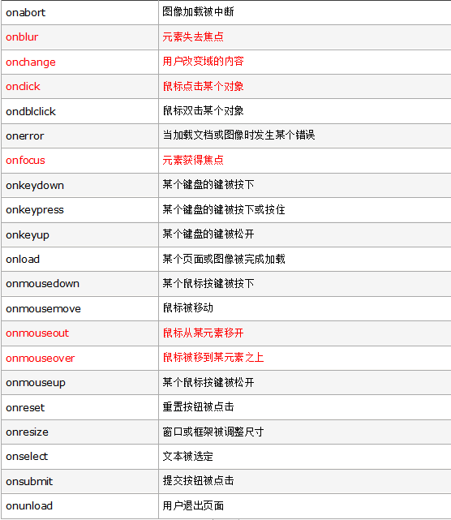

# DOM(document object model)文档对象模型


##  1.事件

+	JS是以事件为驱动的一门语言.

### 事件三要素

+	1.事件源 : 触发事件的对象(比如:button按钮)
+	2.事件	: 怎么触发(比如:点击这个按钮)
+	3.事件驱动	: 即事件执行的结果(比如:点击按钮变红,变红就是结果)

+	JS执行事件的步骤 :
	-	1.获取事件源 
	-	2.绑定事件 
	-	3.编写事件驱动

+	事件附件 :
	
	
	

##  2.DOM的数据结构(树状)
+	DOM树:
	

+	HTML的组成部分为节点
>	在html中一切都是节点:
	- 由结构图中我们可以看到整个文档是一个节点,
	- 每一个HTML标签是一个根节点(标签),
	- 每一个标签是一个元素节点,
	- 标签中的文字是文本节点,
	- 标签中的属性是属性节点,
	- html中的注释是注释节点.


##   获取节点

+	通过id获取节点:document.getElementById();

+	通过class获取节点:document.getElementsByClassName();
	- 通过类名获取元素节点ie8及以下暂不支持,后期框架会有新的兼容的选择器
	- 返回值是HTMLCollection 集合,类似于数组但不是数组,我们称之为"伪数组"

+	document.querySelector() 可以支持ie8,可以通过选择器来获取节点.当参数中为class选择器时,就等于是通过类名获取,但该方法多个相同class名只会获取第一个

+	document.querySelectorAll() 该方法与querySelector类似,但获取的是数组.

+	通过标签名获取id:document.getElementsByTagName();

###   获取父节点
+	一个节点只有一个父节点,语法:节点.parentNode 

###   兄弟节点

+	1.获取下一个兄弟节点:
	-	1.nextSibling  在ie678中指下一个元素节点,在谷歌 火狐 ie9+ 以后都指下一个节点(包括各种节点,也包括文本节点中的空格和换行)
	-	2.nextElementSibling 在谷歌火狐ie9以后指的是下一个元素节点,不兼容ie678
	-	兼容:nextEle = node.nextElementSibling || node.nextSibling (位置不能交换)

+	2.获取上一个兄弟节点:
	-	1.previousSibling 和下一个节点同样的兼容问题
	-	2.previousElementSibling 
	-	兼容:previous = node.previousElementSibling || node.previousSibling

###   单个子节点

+	获取第一个子节点:
+	1.parent.firstChild 在ie678中指第一个元素子节点,在谷歌火狐ie9+表示第一个子节点(包括空格和换行)
+	2.parent.firstElementChild 在谷歌 火狐 ie9+ 表示第一个元素子节点

+	获取最后一个子节点:
+	1.parent.lastChild 在ie678中指最后一个元素子节点,在谷歌火狐ie9+表示最后一个节点(包括空格换行)
+	2.parent.lastElementChild 在谷歌火狐 ie9+表示最后一个元素子节点,不兼容ie678

###   所有子节点

+	parent.childNodes 返回子节点集合(所有节点)
	
+	判断节点的类型:
	-	nodeType == 1 表示元素节点
	-	nodeType == 2 表示属性节点
	-	nodeType == 3 表示文本节点
	-	nodeType == 8 表示注释节点

+	parent.children 返回所有html子节点(但在ie678中会包含注释节点)

+	如何处理获取所有子节点中的兼容问题?

	```
		function myChildren(pNode){
			var cNodesAll = pNode.children;
			var cNodesEle = [];
			for(var i = 0 ; i < cNodesAll.length ; i++){
				if( cNodesAll[i].nodeType == 1){
					cNodeEle.push(cNodesAll[i]);
				}
			}
			return cNodesEle;
		}
	```


##  DOM节点操作

>	获取节点都是.属性,对节点的操作都是方法/函数

###   创建节点

+	创建节点:document.createElement(); 创建之后需要配合插入节点
+	插入节点:pNode.appendChild(cNode); 按先后顺序插入
+	插入参照节点之前:pNode.insertBefore(cNode,参照节点)
	- 如果参照节点为null,则插入到最后

###   删除节点

+	语法 : pNode.removeChild(cNodes);
+	节点自己删除自己:node.parentNode.removeChile(cNode);

###   复制节点

+	语法:1.node.cloneNode() -当没有参数时为浅克隆不会克隆里面的节点
+		 2.node.cloneNode(true) -当参数为true为深克隆会克隆所有的子节点

###   节点属性(节点.属性)

+	获取属性:node.getAttribute(属性名);
+	设置属性:node.setAttribute(属性名,值);
+	删除属性:node.removeAttribute(属性名);


###   value/inneHTML/innerText/textContent

+	value属性只对表单有效
+	innerHTML和innerText中innerHTML可以解析标签后者不可以
+	innerText和textContent类似 后者较老,老版本的火狐不支持innerText,支持textContent
+	使用innerHTML追加元素可能会使之前绑定的事件失效