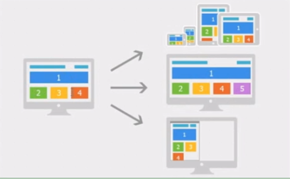

+   网页布局方式
    ```
        1. 固定布局方式: 为网页设置一个固定的宽度,通常以px作为长度单位,常见于PC端网页;

        2. 流式布局: 为网页设置一个相对的宽度,通常以百分比(%)做为长度单位;

        3. 栅格化布局: 将网页宽度人为的划分为均等的长度,然后排版布局时则以这些均等的长度(rem)作为度量单位;(本质也是百分比)

        4. 响应式布局: 通常检测设备信息,决定网页布局方式,即用户如果采用不同的设备访问同一个网页,有可能会看到不一样的布局,一般情况下是检测设备的宽度来实现;
        ( 本质在不同的屏幕宽度下设置div的百分比值;通过一个页面适配各种终端)

        - 注意: 以上几种布局方式并不是独立存在,实际开发过程中往往是相互结合使用(你觉得怎么布局适合就使用哪几种方式);
    ```

+   响应式(bootstrap)
    ``` 
        - 通过 媒体查询 检测当前屏幕的宽度,然后设置当前页面内容的结构和展示样式,达到在不同的终端设备上都能以更好的方式展现;
    ```
    
    ```
        缺点: 因为针对多个终端的显示效果不同,会有一些请求渲染的无效代码;浪费了服务器的响应实践;
        产生冗余的代码,使网页的整体体积变大,
        适合结构内容简洁的站点,页面不能太复杂;
    ```

---
+   什么是响应式开发
    ```
        1. 在移动互联网日益成熟的时候,桌面浏览器上的网页已经满足不了移动设备;

        2. 之前,通常的做法是针对移动设备开发一套特定的版本

        3. 但是,随着移动终端设备的发展,要针对不同的移动设备屏幕做适配

        4. 响应式开发的目的就是一个网站兼容多种终端

        5. 在新建的(现在的网站一般都会使用响应式开发)网站上一般都会使用响应式开发

        6. 移动web开发和响应式开发是必须具备的技能

    ```

+   什么是终端
    ```
        - 终端字面解释就是最后的端头的意思。在互联网中一般我们用的手机电脑等可以看做是终端机。
    ```